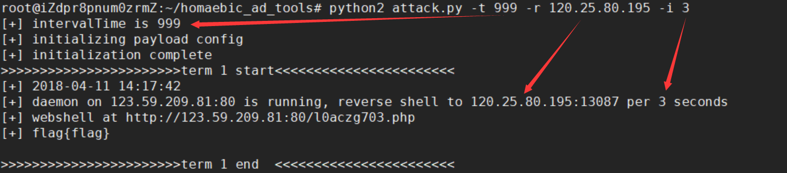
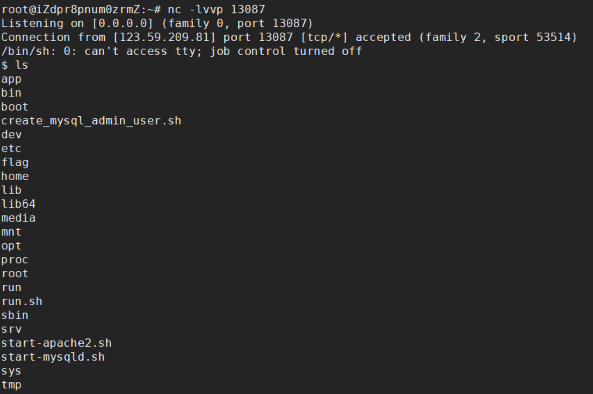

# AWD_auto_attack

Author:Homaebic

## 说明：

脚本会每隔360秒从files/payload.txt取出攻击向量，攻击files/ip.txt中的每个ip，如果可以写入webshell，则写入不死马和进程守护。返回不死马的地址和进程守护反弹的端口。如果不可以写webshell，则根据配置读取flag。

## 用法：
  ```python attack.py -t 360 -r 192.168.1.1 -i 3```


## 文件夹结构：
```
├── attack.py 主程序
├── files
│   ├── door.txt 不死马文件
│   ├── flag.txt 没有用的文件
│   ├── ip.txt 攻击的ip
│   └── payload.txt 配置文件
├── lib
│   ├── kekong.py 进程守护马文件
│   └── ua.txt ua头文件
├── 其他 模块文件
└── README.txt 本文件
```

## 配置说明：
1. cookie要用逗号分割，默认的分号会被当做注释符。
2. 必填项为：[payload*] method getparam webshellreturn signal。
        如果是可以写shell的漏洞，则填写webshellpath webshellpass，不要填写signal的值。
        如果不可以写shell，请填写signal，不要填写webshellpath webshellpass。
3. referer，ua，cookie头均为测试的时候加入的，比赛中如果不需要可以删除或者注释掉，注释的方法是句子前加‘#’或者‘;’
4. 脚本处理不死马的逻辑是将不死马中的{name}替换为随机字符串，然后将这个文件传入到目标主机。访问这个不死马生成真正的不死马。不死马的形式可以自定义，但务必传入的参数是base64格式，传入的键为sxsx23，因为脚本会用sxsx23发送一个base64编码后的phpinfo来检查不死马的通讯情况，后续使用脚本获得flag时也会使用sxsx23和base64编码后的内容获得。

## 不足：
1. 只能利用可以发送单次payload的漏洞。
2. 自动获得flag的功能在遇到返回页面中夹杂很多其他无用数据的时候体验很糟糕
3. 代码写的太烂




